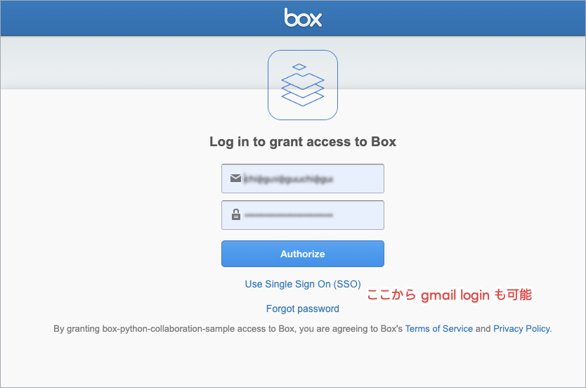
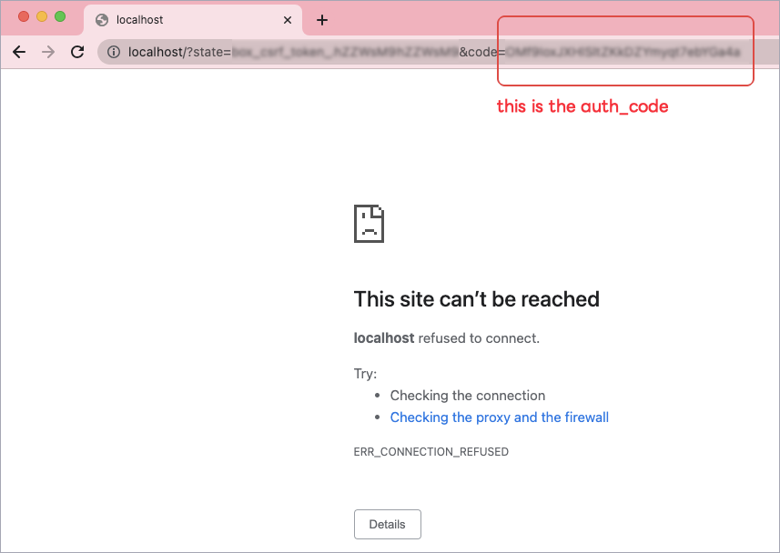
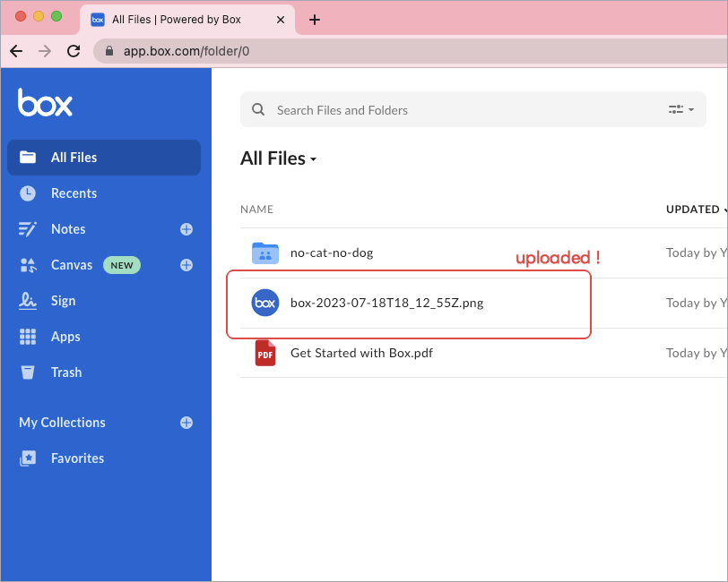

Box + Python collaboration sample
===

🐍 ☁️ Python 3.10 + Box + OAuth 2.0 Demonstration!

## .env が必要

```
DEVELOPER_TOKEN = '...'
CLIENT_ID = '...'
CLIENT_SECRET = '...'
ENTERPRISE_ID = '...'
SETTINGS_FILE_SYS_PATH = '...'
```

## OAuth2 のほう

### Demo

```bash
# こうやって実行すると……
$ pipenv run python oauth2_sample.py

# Box のここへアクセスしてくださいと言われるので、ブラウザでアクセスすると……
Go to this url on your browser: https://account.box.com/api/oauth2/authorize?state=...
```

認証ページが開くよ↓



認証が成功すると、 "OAuth 2.0 Redirect URI" へコードを送ってくれる↓



```bash
# auth_code を貼り付ける↓
Enter the auth code: AUTH_CODE
Access Token: ...
Refresh Token: ...
File "box-2023-07-18T18_12_55Z.png" has been uploaded to Box with file ID: 1261571953317
```

できたよ↓



### まあ Box 側でアプリケーションを作らないといけないけどね

1. ここ↓でアプリケーションを作っていく
    - https://app.box.com/developers/console/newapp
2. Custom App (OAuth 2.0 User Authentication)
    - Purpose: Integration
    - 多分このへん↑はアンケなので適当でいい
    - OAuth 2.0 User Authentication を選ぶ
3. Custom App の設定をする
    - OAuth 2.0 Credentials で Client ID と Client Secret をコピーしとく。
    - OAuth 2.0 Redirect URI: `http://localhost`
    - Application Scopes
        - ここがアプリケーションの権限スコープだね。今回はファイルをアップロードしたいので "write all files ..." にチェックしとくか。

### このプログラムに追加できるとすれば

- 毎回認証ページに飛ばすんじゃなくて、 `refresh_token` を使って認証をスキップするようにする
- アップロード先のフォルダを指定できるようにする

とかかな。

## JWT のほう

### Demo

### まあ Box 側でアプリケーションを作らないといけないけどね

1. ここ↓でアプリケーションを作っていく
    - https://app.box.com/developers/console/newapp
2. Custom App (Server Authentication with JWT)
3. アカウントの 2-Step Verification を設定する (Public/Private Keypair を作るために必要)
4. Custom App の設定をする
    - Application Scopes 追加
    - Add and Manage Public Keys で Generate a Public/Private Keypair
    - CORS Domains (たぶんコレがいる?)
5. Authorization タブで Review and Submit する
6. Admin Console でアプリケーションを承認する
